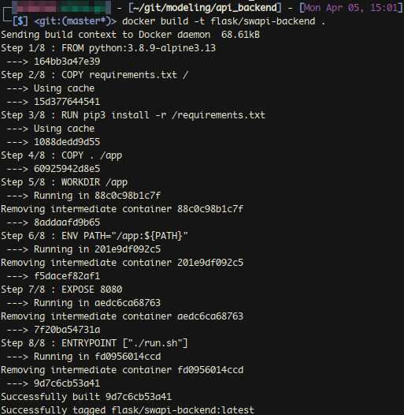
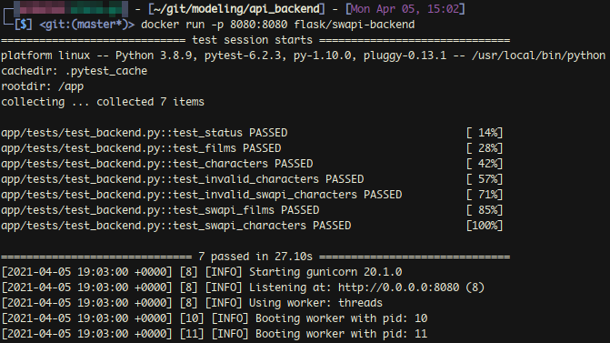
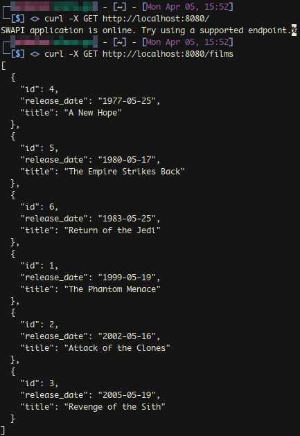
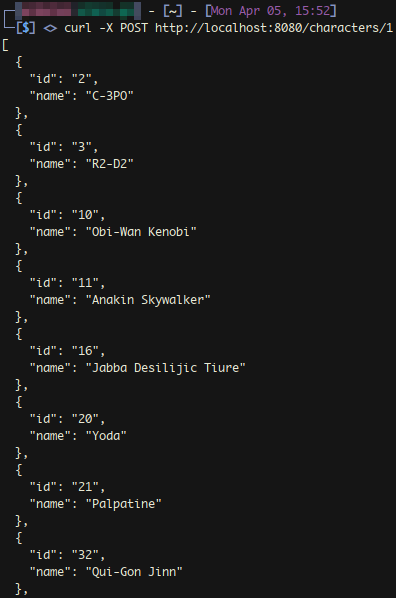

# SWAPI Backend Server
Submission for a code challenge, to build a local backend server in Python with Flask and a WSGI server on top of a 
public REST API.

# Table of Contents
* 1 - [Overview](#section-1)
    * 1.1 [Install](#section-1-1)
    * 1.2 [Run](#section-1-2)
    * 1.3 [Test](#section-1-3)
    * 1.4 [Project Structure](#section-1-4)
* 2 - [Post-Mortem](#section-2)
    * 2.1 [TBD](#section-2-1)
    
    

## Overview

### 1. Install

Clone this repository with the following:

    $ git clone https://github.com/samlarson/swapi-backend.git

If you want to modify and test locally, install the Python packages specified in *requirements.txt*:

    $ pip3 install -r requirements.txt

### 2. Run

To build the image specified in the Dockerfile, enter the following from the root of the project:

    $ docker build -t flask/swapi-backend .

To run the container, enter the following:

    $ docker run -p 8080:8080 flask/swapi-backend
    

    
To check that the server is running correctly and is reachable, you can try the following:

    $ curl -X GET http://localhost:8080/
    > SWAPI application is online. Try using a supported endpoint.

There are two endpoints available: */films* and */characters/<film_id>*. The first will return data related to every 
movie in SWAPI, while the second will return data related to every character in a specified movie.

The films endpoint accepts GET requests, while the characters endpoint accepts POST requests. 
Note that the parameter *film_id* is required for the latter, and corresponds to the Episode # (not chronological order).
Below are the example usages:

    $ curl -X GET http://localhost:8080/
    $ curl -X GET http://localhost:8080/films
    $ curl -X POST http://localhost:8080/characters/1

You can kill the container with the following:

    $ docker kill $(docker ps -a -q  --filter ancestor=flask/swapi-backend)
    

### 3. Test

The pytest framework is used for automated testing of this project. By default, tests are executed on container startup, 
and can also be run locally. To run locally, from the *app* subdirectory of the project, enter the following:

    $ py.test -vvv tests/test_backend.py

Note that the pytest output summary will be displayed in stdout whenever you run the container. To disable this behavior, 
remove the pytest line in *run.sh*.

### 4. Project Structure

**Dependencies:**

- *Docker [(Docs)](https://docs.docker.com/) :* 
Containerization platform
- *Flask [(Docs)](https://flask.palletsprojects.com/en/1.1.x/) :* 
Web framework for Python
- *Gunicorn [(Docs)](https://docs.gunicorn.org/en/stable/) :* 
WSGI server for Python
- *Pytest [(Docs)](https://docs.pytest.org/en/stable/contents.html#toc) :* 
Testing framework for Python

The list below describes the structure of files and sub-directories, from the root of this project:
    
    * README.md: The documentation that you're reading
    * Dockerfile: The configuration file of the Docker image used to run the container
    * requirements.txt: The Python packages required to run the app (installed via pip)
    * run.sh: The entrypoint for the container, which executes pytest and starts the WISG server Gunicorn
    * docs (Directory): Contains images included in documentation
    * app (Directory): Contains all of the Python code for the project
        * api_functions.py: The class and functions responsible for calling SWAPI and formatting serialized JSON
        * backend.py: Flask application initialization, and the functions that define the server routes and return deserialized JSON
        * tests (Directory): Contains the pytest code
            * test_backend.py: Test functions for SWAPI and the flask app

## Post-Mortem

### 1. TBD
